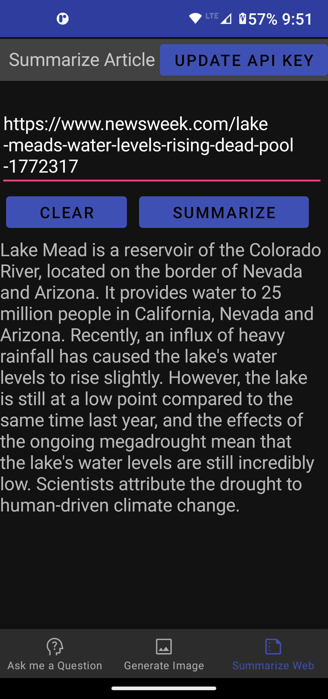

# OpenAI Frontend App

OpenAI Frontend is an Android app designed to demonstrate the capabilities of OpenAI, a machine learning platform. It has three main screens: Ask me a Question, Dalle-2 Image Generation, and Article Summation.

### Ask me a Question

With this screen, you can ask a question, and the OpenAI platform will try to answer it.

### Dalle-2 Image Generation

Using Dalle-2, you can generate images by providing a text prompt.

### Article Summation

This screen allows you to enter a URL and generate a summary of the article.

## Getting an OpenAI API Key

In order to use OpenAI Frontend, you need an OpenAI API Key. You can get one for free by registering for a [developer account](https://developer.openai.com/). Once you have registered, you will be able to find your API key in your profile settings.